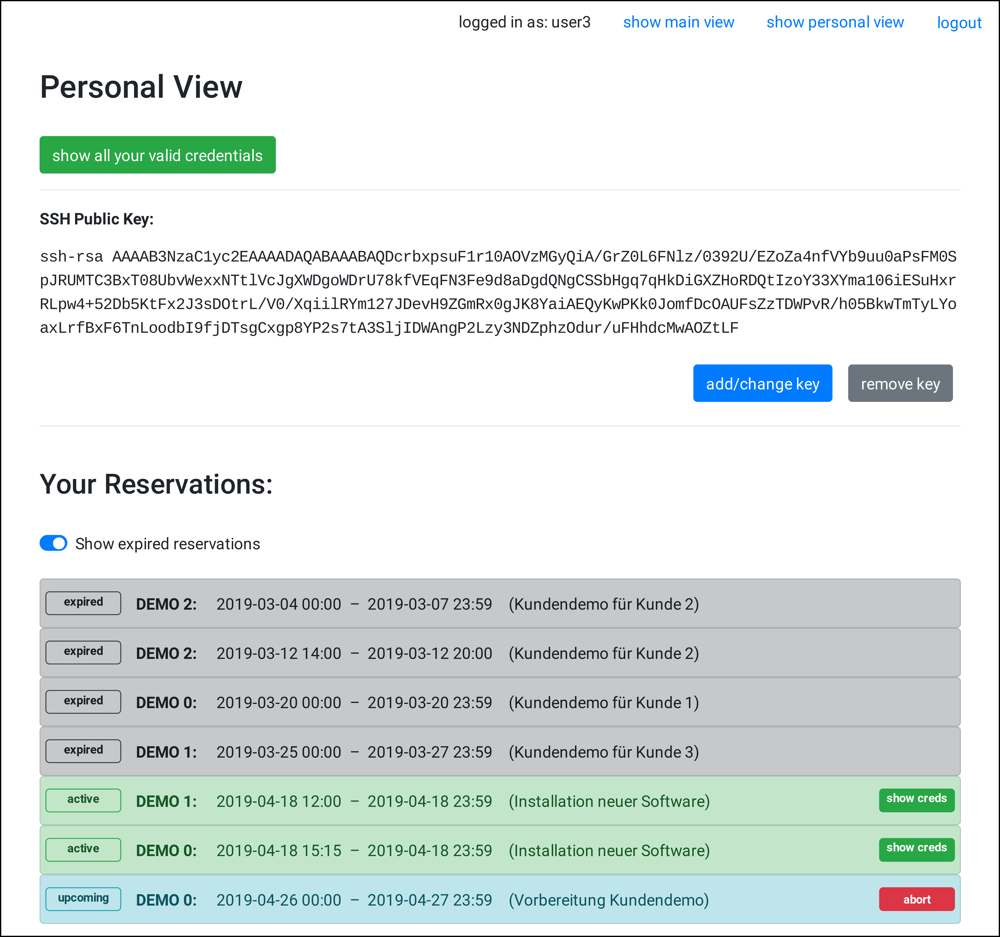

# GAFASPOT - Grant Access for a Specific Period of Time

Gafaspot is software to distribute access to so-called environments between different people. Therefore, Gafaspot uses the Secrets Management System [Vault from HashiCorp](https://www.vaultproject.io/).

In this context, an environment is something like a group of several devices, applications and services which work together in a small network and all require some sort of login for usage. The job of Gafaspot is to grant access to environments in their entirety. You can reserve an environment for a period of time and - as soon as the reservation becomes active - Gafaspot will provide you with credentials for all accounts in the environment. These credentials are only known by you and as long your reservation is valid no one else can get access. Reservations are exclusive.

As soon as a reservation expires, all credentials will become invalid and you have no longer access to the environment, unless you make a new reservation.

## How to Run 
Download Gafaspot's code and dependencies with
```
    go get -u github.com/AdvUni/gafaspot
```
Move into `~/github.com/AdvUni/gafaspot` and compile Gafaspot with
```
    go build
```

To use Gafaspot, you need to install and run a Vault server and define environments in a way Gafaspot can understand. Under `/doc`, you can find several instructions on how to [set up Vault](doc/vault_setup.md) correctly.

When Vault is ready you need to configure Gafaspot itself. This is done in a single configuration file called `gafaspot_config.yaml`. Detailed reference of the [configuration file](doc/config_explanation.md) is also part of the documentation.

You can reach all pages from the documentation's [table of contents](doc/README.md).

## Which Devices
To perform reservations Gafaspot needs to change credentials on all environment's devices. Therefore, Vault's [Secrets Engines](https://www.vaultproject.io/docs/secrets/) are used.

Gafaspot currently supports following Secrets Engines for changing credentials:
* [Active Directory Secrets Engine](secengs_ad.md)
* [SSH Secrets Engine (Signed Certificates)](secengs_ssh.md)
* [Database Secrets Engine](secengs_database.md)
* [Ontap Secrets Engine](secengs_ontap.md) (not an official Vault Secrets Engine)

This means, Gafaspot can perform reservations for accounts which can be managed by one of those Secrets Engines.

## Security
Gafaspot uses Vault to store the credentials of all environments. Vault automatically encrypts data before it writes them to disk. On the other hand, Gafaspot needs access to Vault. Therefore, credentials for accessing Vault are currently written in plain text to Gafaspot's config file. As those credentials enable access to all other credentials, Gafaspot is unsuitable to deal with credentials for highly sensible accounts.

## Web Interface
As soon as Gafaspot is started, users can access it through a web interface. In the web interface they can view all reservations for every environment, create new reservations, read the credentials for their active reservations and upload their public SSH keys (needed for the SSH Secrets Engine).

The web interface is styled with [Bootstrap](https://getbootstrap.com/). The following picture shows a screenshot of a page of the web interface:



## Database
Gafaspot uses an SQLite database for storing some information persistently. More information about the [database scheme](doc/database_scheme.md) can be found in `/doc`.

## Logging
Gafaspot uses `stdlog` from [alexcesaro/log](https://github.com/alexcesaro/log) for logging, which logs to stdout. Gafaspot uses the log levels `DEBUG`, `INFO`, `WARNING`, `ERROR` and `EMERGENCY`. Run `gafaspot --help` to see the command line options provided by the logger.
