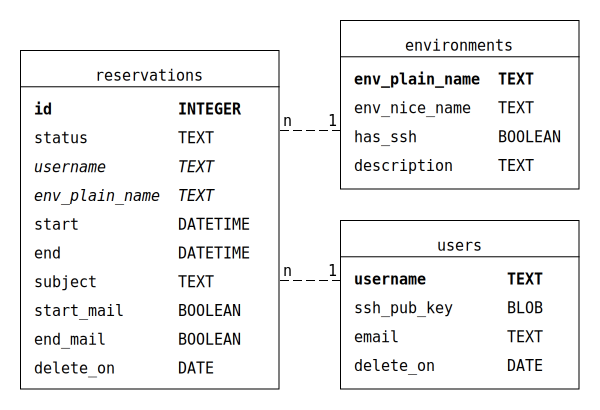

# SQLite Database Scheme

Gafaspot uses a simple SQLite Database to store some information persistently. The database location is determined in the [config file](./config_explanation.md). If a database does not exist yet at the given location, Gafaspot will create one at program start. All necessary tables will be created automatically, so you have to do no database configuration at all.

Anyway, it might be good to have an overview over the database's contents, so the following graphic shows the database scheme used by Gafaspot:

## Tables
Table `reservations` stores all information about reservations created from users in the web interface. Each reservation has a `status` which is one of following:
* `upcoming`
* `active`
* `expired`
* `error`

Gafaspot scans reservations regularly, compares the `start`, `end` and `delete_on` columns with the present point of time, decides whether actions with the reservations must be performed and change the status respectively.

Table `environments` gets recreated each time Gafaspot starts for taking over possible changes in the config file. `env_plain_name` and `env_nice_name` correspond to the different identifiers for environments given in the configuration.

Table `users` is for storing public SSH keys which are uploaded by users in the web interface. SSH keys are needed to perform reservations for environments with SSH Secrets Engine. Entries in table `users` will not be created unless a user uploads a key. Users without a key still can create reservations for environments which do not use the SSH Secrets Engine.

## Relations
The column names *`username`* and *`env_plain_name`* in table `reservations` are italic in the database scheme and therefore marked as foreign keys of the other tables. Correspondingly, there are `1:n` relations between the tables. However, those are not real database relations. There are legitime reasons of reservations in database, where the corresponding user or environment entry does not exists. This is for example, if a user hasn't uploaded an SSH key yet. Further, it can happen that after a restart of Gafaspot, some environments disappear from database because the configuration had changed. This should have no affect to expired reservations. To make such cases possible, there are no dependencies manifested in the database. Keeping the tables consistent is a job of Gafaspot.

## Database manipulations
There are a few direct database manipulations you might want to perform as administrator of gafaspot to control the flow of reservations:
* You can always **delete upcoming reservations** from database. This will cancel the reservation without causing further trouble.
* You can **change an active reservation's end time** if you want to shorten or extend a reservation which is already active. If the environment concerned by this reservation contains an SSH Secrets Engine, Gafaspot will not be able to adapt this changes to the created SSH certificates. So keep in mind, that the validity period of SSH credentials will not fit to the reservation period anymore if you perform such an operation.
* You **must not delete active reservations**, because Gafaspot will not be able to end them properly anymore.
* Reservations with status `expired` or `error` can get deleted any time.

---
*Go back to [table of contents](README.md)...*